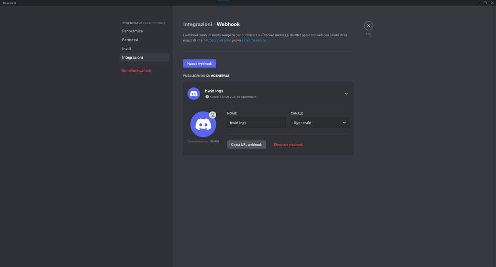
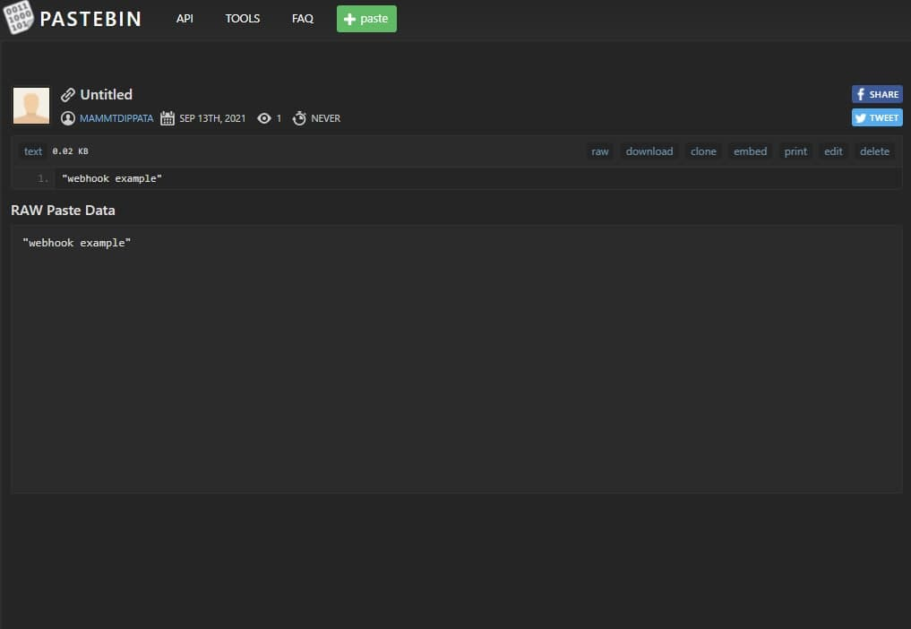
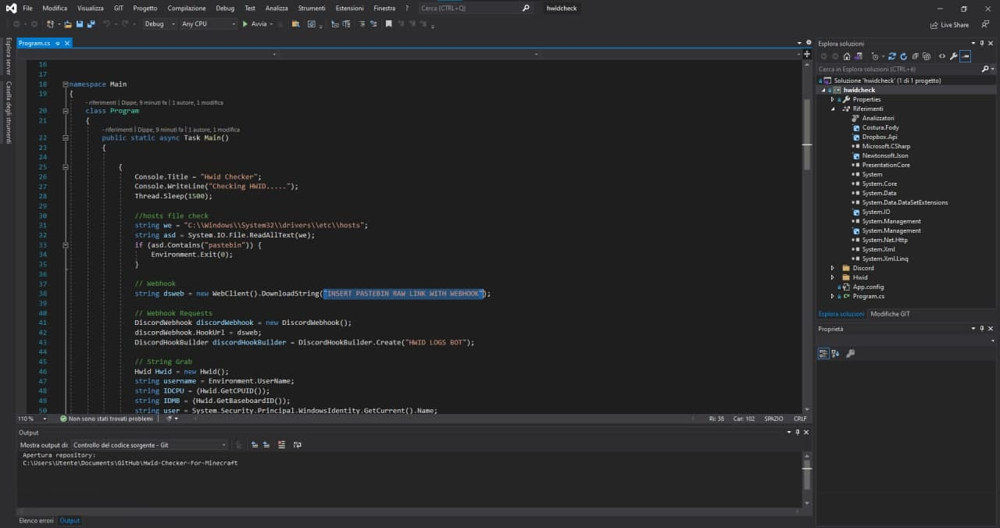
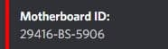

<h1 align="center">HWID CHECK FOR MINECRAFT CHEATS</h1>

# SET WEBHOOK

> CREATE A DISCORD WEBHOOK

  

> CREATE A PASTEBIN RAW WITH IT

  

> PASTE RAW LINK IN SOURCE CODE
> 

  

# HWID BLACKLIST SYSTEM

> GO TO WEBHOOK LOGS AND COPY THE MOTHERBOARD ID
> 

  

